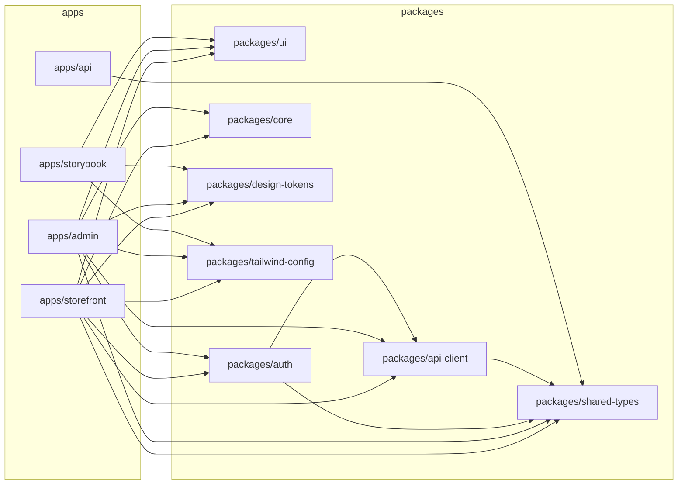
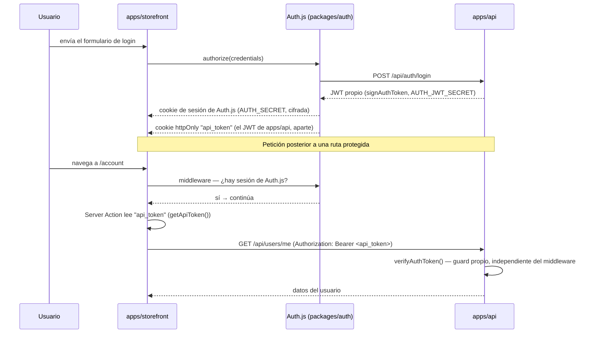

# ARCHITECTURE.md

> Detalle técnico de las decisiones enunciadas en `PROJECT_SPECIFICATION.md`. Si una decisión aquí y en la especificación entran en conflicto, este documento es el que se actualiza primero (es el más específico).

---

## 1. Monorepo & Tooling

- **Gestor de paquetes**: pnpm, versión fijada vía `packageManager` en `package.json` raíz + Corepack. Node.js LTS fijado en `.nvmrc`.
- **Orquestador**: Turborepo. Pipelines mínimos: `build`, `dev`, `lint`, `test`, `test:e2e`, `typecheck`. Cache remota deshabilitada en v1 (proyecto de un solo desarrollador); posible activarla con Vercel Remote Cache si se desea demostrarla.
- **Bundler de desarrollo**: Turbopack (por defecto en `next dev` desde Next.js 15+), no Webpack — arranque y HMR sensiblemente más rápidos en local. No se añade configuración custom de Webpack salvo necesidad concreta y justificada.
- **TypeScript**: `packages/tsconfig` expone `base.json`, `nextjs.json`, `react-library.json`. Todos los `tsconfig.json` de apps/packages extienden de aquí. `strict: true` en toda la base, sin excepciones locales.
- **Lint**: `packages/eslint-config` en flat config (`eslint.config.js`), con presets `base`, `react`, `next`. Incluye `eslint-plugin-jsx-a11y` desde el preset `react`, y `eslint-plugin-testing-library` + el plugin de ESLint para Vitest en el preset aplicado a archivos `*.test.ts(x)` (ver `AGENTS.md` §6).
- **Commits**: Conventional Commits, validados con `commitlint` + hook `commit-msg` de Husky. `lint-staged` corre ESLint + Prettier en pre-commit sobre el diff.
- **Versionado interno**: Changesets para versionar `packages/*` de forma independiente y generar changelogs, aunque no se publiquen a npm (uso interno para practicar el flujo).

### 1.1 Dependencias entre apps y packages

`packages/ui` es una hoja del grafo (no depende de ningún otro paquete interno, ver §2.2) — `apps/storefront`/`apps/admin` hacen fetch HTTP real a `apps/api` (proceso Next.js independiente, no una dependencia de build) vía `packages/api-client`, nunca lo importan como paquete.

## 2. Design System

**No hay diseños previos en Figma.** El design system se construye de forma iterativa, a la par que se necesita para cada página; Storybook es el registro visual vivo del proyecto, no un catálogo pre-diseñado. Esto tiene una consecuencia directa de flujo de trabajo (ver §2.3).

### 2.1 Tokens y Tailwind — personalización comedida

Decisión explícita: **no se monta un pipeline de generación de tokens multiplataforma** (se descarta Style Dictionary por sobre-ingeniería para el alcance de este proyecto). En su lugar:

- Partimos de la paleta, escala tipográfica, espaciados y radios **por defecto de Tailwind**, que ya son de calidad profesional.
- `packages/design-tokens` contiene únicamente los valores que decidimos personalizar de forma justificada (color de acento de marca + una familia tipográfica propia para heading/display), como constantes TS simples **y** las custom properties CSS equivalentes (`tokens.css`) — sin capa de transformación entre ambas, se mantienen a mano.
- **Tailwind v4, CSS-first**: no hay `tailwind.config.js`. `packages/tailwind-config` expone un único `preset.css` que hace `@import "tailwindcss"` + `@import` del `tokens.css` de `design-tokens` (que trae su propio bloque `@theme`, así que los tokens personalizados quedan añadidos por encima de los defaults sin redefinir la paleta). Todas las apps consumen este preset con un único `@import` en su hoja de estilos global; ninguna app define su propia paleta en local.
- Objetivo: demostrar criterio para personalizar un design system (saber qué tocar y qué no tocar), no reconstruir Tailwind desde cero.
- **Detección de contenido**: Tailwind v4 escanea automáticamente el árbol de la app que hace el `@import` — ya no hay array `content` que mantener a mano. La única salvedad es `packages/ui`, que vive fuera del árbol de cualquier app consumidora: `preset.css` declara explícitamente `@source "../../ui/src"` una sola vez, así que todo consumidor del preset hereda esa cobertura sin tener que repetirla.
- **Dark mode — solo el acento, por ahora**: `#c2410c` sobre fondos oscuros no llega a 4.5:1 (ronda 3.4-3.8:1), así que `tokens.css` redefine `--color-accent`/`--color-accent-hover`/`--color-accent-foreground`/`--color-accent-soft` dentro de `@media (prefers-color-scheme: dark)` — sin `dark:` en ningún componente de `packages/ui`, porque las utilidades de Tailwind ya apuntan a esas custom properties y heredan el cambio solas. `Badge` promovió su variante `accent` de `bg-accent/10` (opacidad estática) a un token propio `--color-accent-soft`, porque la opacidad correcta para mantener AA difiere entre claro (10%) y oscuro (18%) y un modificador `/10` no puede variar por media query. El resto de la paleta (grises, colores semánticos de `Badge`) sigue siendo solo-claro — no hay toggle manual de tema ni Context de UI para ello todavía, así que el único disparador es la preferencia del sistema operativo.

### 2.2 `packages/ui`

Atomic Design (`atoms`, `molecules`, `organisms`). Reglas:

- No importa React Hook Form, Zod, TanStack Query, Zustand ni nada de `features/*`.
- Cada componente recibe datos y callbacks por props; es "tonto" por diseño.
- Co-localización: `Button/Button.tsx`, `Button/Button.stories.tsx`, `Button/Button.test.tsx`, `Button/index.ts` (barrel).
- Accesibilidad verificada por el addon `a11y` de Storybook en cada historia.

`apps/storybook` consume `packages/ui` únicamente; no conoce ninguna app de negocio.

### 2.3 Flujo de trabajo: component-first, página a página

Al no partir de un diseño cerrado, el orden de trabajo para cualquier página/template nueva es siempre:

1. Identificar qué átomos/moléculas/organismos necesita esa página.
2. Comprobar si ya existen en `packages/ui`. Si existen, reutilizar. Si no, crearlos ahí (con su story y su test), nunca directamente dentro de la página.
3. Solo entonces ensamblar la página en `apps/<app>` a partir de esas piezas.

`packages/ui` nunca se da por "cerrado" de antemano ni se intenta completar el 100% de un inventario hipotético en una única fase: crece bajo demanda, pero siempre un paso por delante de la página que lo consume, nunca por detrás (no se permite maquetar directamente en la página "para ir más rápido" y prometer refactor a `packages/ui` después).

## 3. Backend fake (`apps/api`)

**Decisión**: Next.js App Router usado exclusivamente para Route Handlers (`app/api/**/route.ts`), sin páginas ni UI. Persistencia con **Prisma + SQLite** (fichero local, sin infraestructura externa), vía el driver adapter `@prisma/adapter-better-sqlite3` (Prisma 7 ya no admite `url` directo en el `datasource` de `schema.prisma`; la connection string vive en `prisma.config.ts`).

Razonamiento: un `json-server` no permite demostrar diseño de esquema, migraciones ni lógica de negocio en el borde servidor; un backend real (aunque ligero) sí, y es más representativo de un entorno profesional real donde el frontend consume un BFF/API propio.

Responsabilidades:

- Esquema Prisma para `Product`, `Category`, `User`, `Order`, `OrderItem`, `CartItem` _(decidido en Fase 2)_: `CartItem` es tabla propia ligada a `User`+`Product` (`@@unique([userId, productId])`), no un `Order` en estado `draft` — separa el ciclo de vida efímero del carrito del inmutable de un pedido. Dinero siempre en céntimos (`Int`): `priceCents`, `unitPriceCents` (snapshot inmutable en `OrderItem`, no duplicación real con `Product.priceCents` — son dos conceptos que deben poder divergir), `totalCents`. SQLite no soporta enums nativos de Prisma: `role`/`status` son `String`, la unión de literales vive solo en el `z.enum` de `shared-types` correspondiente. _(Fase 5)_ `CartItem.userId` pasa a `String?` (nullable) y gana `CartItem.guestId String?` + índice, para soportar carritos de invitado sin sesión (`@@unique([userId, productId])` y `@@unique([guestId, productId])` en paralelo) — exactamente uno de los dos no-null, invariante validada en `apps/api`, no a nivel de constraint SQL.
- Migraciones versionadas (`prisma migrate`) + script de seed con datos de ejemplo (usar `@faker-js/faker` para variedad, con seed fijo para reproducibilidad). Catálogo enfocado en apparel/streetwear (Camisetas, Gorras, Zapatillas), no un e-commerce genérico. Las fotos de producto se buscan en la **API de búsqueda de Unsplash** (moderada y relevante por keyword; se descartaron `picsum.photos`/`loremflickr.com` por dar fotos irrelevantes o, en el caso de `loremflickr`, contenido inapropiado) y se re-suben a **Cloudinary** (tier gratuito, vía _unsigned upload preset_ para no requerir el API secret); el campo `imageUrl` de `Product` guarda la URL final de Cloudinary, no un binario ni un asset local.
- Validación de entrada con Zod en cada Route Handler, usando los esquemas de `packages/shared-types` (nunca se valida "a mano").
- Respuestas siempre tipadas y validadas también en la salida en desarrollo (para detectar drift entre Prisma y los contratos Zod), vía un helper `validateOutputInDev` que solo se ejecuta fuera de `NODE_ENV=production`.
- Formato de respuesta uniforme: éxito `{ data: T }`, error `{ error: { message: string } }`, con status HTTP explícito (400 validación Zod, 404 not-found, 409 conflicto de integridad referencial, 500 inesperado).
- Autenticación: endpoint de login que emite JWT, consumido por Auth.js como Credentials Provider (ver §4). _(Fase 5, cierra el hueco de Fase 2)_ Los Route Handlers de carrito/pedidos/perfil ya no reciben `userId` en la URL (`/api/cart`, `/api/orders`, `/api/users/me`, sin segmento de usuario): la identidad se deriva siempre server-side de un token verificado (`Authorization: Bearer`, `apps/api/src/lib/jwt.ts#verifyAuthToken`) o, para carritos de invitado, de un header opaco sin verificar (`X-Guest-Id` — sin datos sensibles que proteger, ver §4). Nunca se confía en un id que el cliente pueda fijar en la URL/body.
- Consultas Prisma con `include`/`select` explícitos para traer relaciones en una sola query (p. ej. `Order` con sus `OrderItem`); nunca una query dentro de un bucle (N+1) para resolver relaciones.

`packages/api-client` es el único punto de la app que hace `fetch` contra `apps/api`. Expone funciones por dominio (`getProducts()`, `getProductBySlug()`, `createOrder()`...) que:

1. Hacen la petición HTTP.
2. Parsean la respuesta con el Zod schema de `shared-types` correspondiente (`schema.parse(json)`), lanzando un error tipado si no matchea.
3. Devuelven el tipo inferido (`z.infer<typeof Schema>`), nunca `any`.

Las features consumen `api-client` desde sus hooks de TanStack Query (`features/products/hooks/useProducts.ts`), nunca hacen `fetch` directamente.

**Testing**: en unit/integración, MSW intercepta las llamadas de `api-client` sin necesidad de levantar `apps/api`. En E2E (Playwright), sí corre `apps/api` real contra una SQLite de test, reseteada entre suites.

## 4. Autenticación (`packages/auth`) _(implementado en Fase 5)_

### 4.1 Los dos JWT independientes

El punto que más cuesta seguir solo en prosa: hay **dos** JWT distintos, con secretos distintos, que nunca se mezclan.

`api_token` **nunca** pasa por el callback `session()` de Auth.js ni llega a `useSession()`/al cliente — solo se lee server-side. Esto es lo que permite que `apps/api` (un proceso Next.js totalmente independiente, en otro origen) verifique la identidad por su cuenta, sin confiar en el guard de middleware de `apps/storefront`/`apps/admin` (defensa en profundidad, `AGENTS.md §10`).

- **Auth.js (NextAuth) v5**, Credentials Provider contra `apps/api` (`POST /api/auth/login`). `authorize()` llama a `login()` de `api-client`; si las credenciales son válidas, el `token` que ya emite `apps/api` (`signAuthToken`) se guarda en su **propia cookie httpOnly** (`api_token`, `packages/auth/src/cookies.ts`) — deliberadamente **no** viaja dentro del JWT cifrado que gestiona Auth.js ni se expone en el objeto `session()`, así que nunca llega a `useSession()`/al cliente. `getApiToken()` (server-only) es el único punto de lectura para Server Actions que necesitan llamar a `apps/api` en nombre del usuario.
- Estrategia de sesión: JWT (sin sesión en base de datos). `JWT_EXPIRATION` de `apps/api` es de **7 días** (no 30, como se decidió inicialmente — ajustado en una revisión de código posterior) porque no hay revocación/blacklist de tokens: es la única forma de acotar la ventana de exposición de un token filtrado o usado tras logout. Para que un usuario activo no note esa ventana corta, `getApiToken()` (`packages/auth/src/get-api-token.ts`) desliza el `maxAge` de la cookie `api_token` en cada lectura — igual que el `updateAge` con el que Auth.js renueva su propia sesión — así que ambas cookies quedan alineadas sin compartir secreto ni tener que refrescar el JWT de Auth.js. **Matiz real, no solo teórico**: `cookies().set()` de `next/headers` solo funciona dentro de una Server Action invocada de verdad (formulario o llamada desde un Client Component) o un Route Handler, nunca durante el render de un Server Component — una Server Action de solo lectura llamada directamente desde un Server Component (p. ej. `getOrdersAction` desde `OrderHistorySection`) sigue siendo "render", no una invocación de acción. El intento de deslizar la cookie en ese camino se envuelve en un `try/catch` que falla en silencio (`get-api-token.ts`); se detectó en pruebas manuales, no en tests (jsdom no reproduce esta restricción de Next).
- Roles: `customer` y `admin`, incluidos en el JWT firmado por `apps/api` y en el `session.user.role` que expone Auth.js.
- **Sin `SessionProvider`/`useSession()` en cliente**: el proyecto no usa Context API para la sesión (a diferencia de lo previsto originalmente en esta sección) — `auth()` de `packages/auth` se llama directamente en Server Components (`SiteHeader`, `/account`) y el resultado se pasa como props a los pocos Client Components que lo necesitan (mismo patrón `SiteHeader`/`CartAwareNavbar` de Fase 4). Evita tener que decidir qué exponer de forma segura en un Context de cliente. **Edición de perfil** (nombre/email desde `/account`) lleva este criterio un paso más allá: la página nunca lee `session.user.name/email` (quedarían cacheados en el JWT desde el sign-in hasta el próximo login) sino que pide el perfil fresco a `apps/api` en cada visita (`GET /api/users/me`, vía `features/account/api/get-profile.action.ts`) — mismo patrón que ya usa el historial de pedidos, evita la complejidad de refrescar el JWT de Auth.js tras una edición. `PATCH /api/users/me` actualiza nombre/email con el mismo guard de identidad que `cart`/`orders` (Bearer token verificado, nunca un id en la URL).
- Guards: `withAuthGuard()` (`packages/auth/src/middleware-guard.ts`) construye un `NextAuth()` propio a partir de una config edge-safe (`auth.config.ts`, sin el Credentials Provider ni callbacks que toquen `next/headers` — ambos solo viven en `config.ts`, la config completa) para poder correr en el Edge runtime de `middleware.ts`. `apps/storefront/src/middleware.ts` protege `/account/**`, redirigiendo a `/login?callbackUrl=...` si no hay sesión. Reutilizable desde `apps/admin` en Fase 7 con otro `protectedPaths`.
- **Defensa en profundidad**: además del guard de middleware, cada Route Handler autenticado (`cart`/`orders`/`users`) revalida el token independientemente, a través de un único manejador compartido (`handleAuthenticatedRouteError` en `apps/api/src/lib/guard.ts`, renombrado desde `handleCartRouteError` al dejar de ser exclusivo de carrito) — el guard de frontend es una capa adicional, no la única barrera de autorización, tal como exige `AGENTS.md §10`.
- `storefront` permite navegación anónima completa del catálogo y del carrito (carrito de invitado vía `X-Guest-Id`, ver §3); solo exige sesión en checkout, "mis pedidos" y "mi cuenta". Al iniciar sesión (login o justo después de un registro), el callback `signIn` de `packages/auth` fusiona el carrito de invitado (cookie `guest_cart_id`) dentro del carrito del usuario (`POST /api/cart/merge`, suma cantidades de productos repetidos) y borra la cookie de invitado **solo si la fusión tuvo éxito** — si `apps/api` falla en ese instante, la cookie se conserva para poder reintentar en un login posterior en vez de perder esos `CartItem` para siempre.
- **`UserMenu` (`packages/ui/src/organisms/UserMenu`)**: desplegable de cuenta en el navbar (sustituye al enlace de texto "Iniciar sesión"), alineado a la derecha del carrito. No es modal (sin foco atrapado, a diferencia de `CartDrawer`): solo se cierra con Escape o al hacer click fuera. `packages/ui` sigue sin conocer `next/link`/lógica de negocio — `SiteHeader` (Server Component) le pasa los items (enlaces + `<form action={logout}>`) ya compuestos. Detalle de implementación no obvio: cerrar el menú de forma síncrona al hacer click en un item que es el submit de un `<form>` (logout) desmonta el formulario antes de que el navegador complete su envío nativo, cancelándolo — el cierre se difiere con `setTimeout(0)`.

## 5. Gestión de estado — límites explícitos

| Tipo de estado                                                       | Herramienta         | Ejemplos                                                                                                                             |
| -------------------------------------------------------------------- | ------------------- | ------------------------------------------------------------------------------------------------------------------------------------ |
| Estado de servidor (remoto, cacheable, con ciclo de vida propio)     | TanStack Query      | Catálogo de productos, detalle de producto, historial de pedidos, carrito persistido en backend                                      |
| Estado de cliente mutable, con lógica de actualización               | Zustand             | Apertura de modales/drawers, paso actual del wizard de checkout, filtros no persistidos de la UI                                     |
| Configuración / inyección de dependencias de subárbol, semi-estática | Context API (React) | Tema claro/oscuro, futura configuración de i18n — la sesión de Auth.js **no** usa Context/`SessionProvider` en este proyecto, ver §4 |

Reglas duras:

- Si un dato sobrevive a un refresco de página o se comparte entre pestañas vía backend → TanStack Query.
- Si es estado de cliente que cambia con frecuencia y tiene lógica de actualización (reducers, acciones, derivaciones) → Zustand.
- Si es un valor que rara vez cambia y solo se necesita "inyectar" en un subárbol sin lógica de store (p. ej. la sesión ya resuelta, el tema activo) → Context API.
- Si ninguna de las anteriores aplica y el estado no se comparte entre componentes → `useState`/`useReducer` local.

Señal de alarma: un Context que empieza a acumular múltiples acciones de actualización y lógica derivada debería migrarse a Zustand.

## 6. Testing — estrategia por capa

- **Unit** (Vitest + Testing Library): componentes de `packages/ui` en aislamiento, hooks de dominio con `renderHook`, funciones puras de `services/` y `utils/`.
- **Integración** (Vitest + Testing Library + MSW): una feature completa montada con sus providers reales (`packages/testing` expone un `renderWithProviders` que envuelve QueryClientProvider, tema, etc.), interceptando red con MSW.
- **E2E** (Playwright): flujos de usuario end-to-end contra `apps/api` real. Mínimo: navegación de catálogo → añadir al carrito → checkout completo (storefront), login → CRUD de producto (admin).
- **Accesibilidad**: `@axe-core/playwright` en los mismos specs E2E críticos + addon a11y de Storybook en cada historia de `packages/ui`. Objetivo: 0 violaciones "serias" o "críticas" de axe en las rutas principales.
- **Performance**: Lighthouse CI (`.github/workflows/lighthouse.yml`, `apps/storefront/lighthouserc.cjs`) sobre `storefront` (build de producción, preset móvil por defecto de Lighthouse) en `/`, `/products` y `/products/[slug]`. Presupuestos afinados con datos reales en Fase 8: CLS < 0.1 y TBT < 200ms se mantuvieron tal cual (ya cumplían sin margen que ajustar); LCP subió de 2.5s a 3.2s — el valor inicial no era alcanzable en un entorno local sin CDN/edge caching delante de Cloudinary, se revisa a la baja si la demo pública (última tarea de Fase 8) despliega con CDN real. INP no se audita (Lighthouse no la mide de forma fiable en una página sin interacción real de usuario, es una métrica de campo); TBT actúa de proxy de laboratorio. El dataset del workflow se seedea con `apps/api/prisma/seed-lighthouse.ts` (misma estructura que el seed real, pero con una imagen de muestra pública de Cloudinary en vez de subir vía Unsplash) para no depender de secretos externos ni de su cuota en cada run de CI.

`packages/testing` centraliza: `renderWithProviders`, setup de servidor MSW (`setupServer`), factories de datos de dominio (usando los mismos schemas Zod de `shared-types` para generar fixtures válidas por construcción, con valores realistas generados por `@faker-js/faker` en vez de placeholders repetidos — ver `AGENTS.md` §6).

## 7. CI/CD (GitHub Actions)

Workflows mínimos:

- `ci.yml`: en cada PR — install (con cache de pnpm), `turbo lint typecheck test build` en paralelo vía Turborepo, luego migra+seedea `apps/api` (dataset ligero, ver §6) e instala los navegadores de Playwright, y corre `turbo test:e2e --concurrency=1` (serializado a propósito: `storefront` y `admin` gestionan cada una su propia instancia de `apps/api` vía `webServer`, puerto 4000 fijo — en paralelo la segunda encuentra el puerto ya ocupado). Fase 8 cerró el hueco real de que `test:e2e` nunca se ejecutaba en CI.
- `lighthouse.yml`: migra y seedea `apps/api` (dataset ligero, ver §6), levanta `apps/api`, hace build de `storefront` y corre Lighthouse CI — falla si se rompe un presupuesto.
- `changesets.yml` (opcional, Fase 8): automatiza el versionado de paquetes al mergear a la rama principal.

No hay despliegue real a producción (no hay "producción"), solo una demo pública para poder enlazar el proyecto desde GitHub/CV. Decisión tomada en Fase 8 (2026-07-12, ver adenda de `docs/ROADMAP.md`): **Vercel** para las 3 apps (`storefront`, `admin`, `api`), cada una como proyecto independiente sobre el mismo repo (Root Directory `apps/storefront`/`apps/admin`/`apps/api`) — se descarta GitHub Pages porque el proyecto depende de Server Components con fetch en servidor, Server Actions y middleware, incompatibles con un export estático. `apps/api` migró su datasource de `better-sqlite3` (fichero local) a **Turso (libSQL)**, ya que las funciones serverless de Vercel no tienen filesystem persistente; `apps/api/src/lib/prisma.ts` usa `@prisma/adapter-libsql`, compatible tanto con `file:./dev.db` en local como con una URL `libsql://...-turso.io` en producción, sin cambiar el schema de Prisma. Sin dominio propio por ahora (solo `*.vercel.app`), aunque el dominio ya registrado en Cloudflare por el usuario queda como opción futura sin re-trabajo. Desplegado y verificado end-to-end (2026-07-13): [`storefront`](https://store-demo-storefront-kappa.vercel.app), [`admin`](https://store-demo-admin.vercel.app), [`api`](https://store-demo-api.vercel.app).

## 8. Flujo de trabajo de desarrollo — Worktrees

Para poder trabajar en varios frentes en paralelo sin bloquearse por cambios sin commitear (p. ej. avanzar una feature mientras se corrige algo en el design system, o comparar dos aproximaciones), el desarrollo se apoya en **git worktrees** en lugar de cambiar de rama sobre un único working directory. Cada frente de trabajo relevante (fase, feature grande, spike) puede vivir en su propio worktree con su propia rama.

Consecuencias prácticas:

- No se asume que solo existe un working directory activo sobre el repo.
- El estado de `node_modules`/instalación de dependencias debe poder reproducirse por worktree (pnpm lo soporta bien vía su store global de contenido).
- Se contempla, como candidato de backlog (no comprometido todavía, ver `ROADMAP.md`), construir una pequeña app interna de gestión de worktrees (monitorización de cuáles existen, creación, edición y borrado) para no depender de comandos manuales de `git worktree` — esto sería en sí mismo una demostración adicional de tooling interno / DX.

## 9. Convenciones operativas

Delegadas íntegramente a `AGENTS.md` (naming, estructura de imports/exports, límites de Server/Client Components, formularios, etc.) para no duplicar contenido entre documentos.
